[](https://github.com/bodgit/psx/releases)
[](https://github.com/bodgit/psx/actions?query=workflow%3Abuild)
[](https://coveralls.io/github/bodgit/psx?branch=main)
[](https://goreportcard.com/report/github.com/bodgit/psx)
[](https://godoc.org/github.com/bodgit/psx)


psx
===

A collection of libraries and utilities for dealing with Sony PlayStation 1 file formats.

Full installation:
```
go get github.com/bodgit/psx/...
```
Or grab a pre-built binary from the [releases page](https://github.com/bodgit/psx/releases).

## psx

The `psx` utility currently allows you to split generic memory cards (such as those created by the [8BitMods MemCard PRO](https://8bitmods.com/memcard-pro-for-playstation-1-smoke-black/)) into per-game memory cards for use with a supported ODE.

A quick demo:


